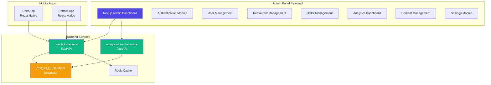

# OneQlick Admin Panel - Complete Overview

## 📋 Executive Summary

The **OneQlick Admin Panel** is a comprehensive web-based administrative dashboard designed to manage the entire food delivery platform ecosystem. This document provides a complete analysis of the system architecture, database schema, and feature requirements based on the existing mobile apps and backend services.

---

## 🎯 Purpose & Scope

The admin panel serves as the **central control hub** for:
- **Platform Operations**: Monitor and manage all platform activities
- **User Management**: Oversee customers, restaurant owners, and delivery partners
- **Restaurant Operations**: Approve, manage, and monitor restaurants
- **Order Management**: Track and resolve order issues
- **Financial Operations**: Manage payments, refunds, and platform fees
- **Analytics & Reporting**: Generate insights and business intelligence
- **Content Management**: Manage categories, coupons, and promotional content
- **System Configuration**: Configure platform settings and parameters

---

## 🏗️ System Architecture

### Technology Stack Recommendation

```
Frontend:
├── Framework: Next.js 14+ (React with App Router)
├── Language: TypeScript
├── UI Library: shadcn/ui + Tailwind CSS
├── State Management: Zustand / React Query
├── Charts: Recharts / Chart.js
├── Tables: TanStack Table (React Table v8)
├── Forms: React Hook Form + Zod validation
└── API Client: Axios with interceptors

Backend Integration:
├── Main API: oneqlick-backend (FastAPI)
├── Search Service: oneqlick-search-service (FastAPI)
└── Authentication: JWT-based with refresh tokens

Deployment:
├── Hosting: Vercel / Netlify
├── CDN: Cloudflare
└── Environment: Production, Staging, Development
```

### Architecture Diagram



---

## 📊 Database Schema Analysis

### Core Tables (40+ Tables)

Based on the SQL script analysis, the system has **40+ interconnected tables**:

#### **1. User Management (7 tables)**
- `core_mstr_one_qlick_users_tbl` - Main users table
- `core_mstr_one_qlick_addresses_tbl` - User addresses
- `core_mstr_one_qlick_user_preferences_tbl` - User preferences
- `core_mstr_one_qlick_user_favorites_tbl` - Favorite restaurants
- `core_mstr_one_qlick_user_payment_methods_tbl` - Payment methods
- `core_mstr_one_qlick_user_wallets_tbl` - User wallets
- `core_mstr_one_qlick_user_analytics_tbl` - User analytics

#### **2. Restaurant Management (6 tables)**
- `core_mstr_one_qlick_restaurants_tbl` - Restaurant details
- `core_mstr_one_qlick_restaurant_offers_tbl` - Restaurant offers
- `core_mstr_one_qlick_restaurant_features_tbl` - Restaurant features
- `core_mstr_one_qlick_categories_tbl` - Food categories
- `core_mstr_one_qlick_food_items_tbl` - Menu items
- `core_mstr_one_qlick_food_variants_tbl` - Food variants

#### **3. Order Management (7 tables)**
- `core_mstr_one_qlick_orders_tbl` - Orders
- `core_mstr_one_qlick_order_items_tbl` - Order items
- `core_mstr_one_qlick_order_tracking_tbl` - Order tracking
- `core_mstr_one_qlick_order_status_history_tbl` - Status history
- `core_mstr_one_qlick_order_item_customizations_tbl` - Customizations
- `core_mstr_one_qlick_order_item_addons_tbl` - Add-ons
- `core_mstr_one_qlick_wallet_transactions_tbl` - Wallet transactions

#### **4. Delivery Management (3 tables)**
- `core_mstr_one_qlick_delivery_partners_tbl` - Delivery partners
- `core_mstr_one_qlick_driver_locations_tbl` - Real-time locations
- Vehicle tracking data

#### **5. Shopping Cart (5 tables)**
- `core_mstr_one_qlick_cart_tbl` - Shopping carts
- `core_mstr_one_qlick_cart_items_tbl` - Cart items
- `core_mstr_one_qlick_cart_item_customizations_tbl` - Customizations
- `core_mstr_one_qlick_cart_item_addons_tbl` - Add-ons
- `core_mstr_one_qlick_food_addons_tbl` - Available add-ons

#### **6. Promotions & Coupons (3 tables)**
- `core_mstr_one_qlick_coupons_tbl` - Coupons
- `core_mstr_one_qlick_user_coupon_usage_tbl` - Usage tracking
- Restaurant-specific offers

#### **7. Reviews & Ratings (2 tables)**
- `core_mstr_one_qlick_reviews_tbl` - Reviews
- Rating aggregations

#### **8. Authentication & Security (5 tables)**
- `core_mstr_one_qlick_refresh_tokens_tbl` - JWT refresh tokens
- `core_mstr_one_qlick_oauth_providers_tbl` - OAuth providers
- `core_mstr_one_qlick_otp_verification_tbl` - OTP verification
- `core_mstr_one_qlick_user_sessions_tbl` - User sessions
- `core_mstr_one_qlick_password_reset_tokens_tbl` - Password resets

#### **9. Notifications (1 table)**
- `core_mstr_one_qlick_notifications_tbl` - System notifications

#### **10. Search & Analytics (2 tables)**
- `core_mstr_one_qlick_search_history_tbl` - Search history
- User analytics and insights

---

## 🔐 User Roles & Permissions

### Role Hierarchy

```
┌─────────────────────────────────────┐
│         SUPER ADMIN                 │
│  (Full system access)               │
└─────────────────┬───────────────────┘
                  │
        ┌─────────┴─────────┐
        │                   │
┌───────▼────────┐  ┌──────▼──────────┐
│  ADMIN         │  │  OPERATIONS     │
│  (Most access) │  │  (Limited)      │
└───────┬────────┘  └──────┬──────────┘
        │                  │
        └────────┬─────────┘
                 │
        ┌────────▼─────────┐
        │   SUPPORT AGENT  │
        │   (Read + Basic) │
        └──────────────────┘
```

### Permission Matrix

| Feature | Super Admin | Admin | Operations | Support |
|---------|------------|-------|------------|---------|
| User Management | ✅ Full | ✅ Full | ✅ View/Edit | 👁️ View |
| Restaurant Approval | ✅ | ✅ | ✅ | ❌ |
| Order Management | ✅ | ✅ | ✅ | ✅ Limited |
| Financial Reports | ✅ | ✅ | 👁️ View | ❌ |
| System Settings | ✅ | ⚠️ Limited | ❌ | ❌ |
| Analytics | ✅ | ✅ | ✅ | 👁️ View |
| Coupon Management | ✅ | ✅ | ✅ | ❌ |
| Content Management | ✅ | ✅ | ✅ | ❌ |

---

## 📱 Existing Features Analysis

### From User App (oneQlick-User-App)
- ✅ Authentication (Login, Signup, OTP, Google OAuth)
- ✅ Restaurant browsing with filters
- ✅ Food item search and discovery
- ✅ Shopping cart with customizations
- ✅ Order placement and tracking
- ✅ User profile management
- ✅ Address management
- ✅ Payment methods
- ✅ Order history
- ✅ Notifications
- ✅ Favorites
- ✅ Wallet integration

### From Partner App (oneqlick-partner-app)
- ✅ Partner authentication
- ✅ Order management (Restaurant & Delivery views)
- ✅ Real-time order tracking
- ✅ Profile management
- ✅ Notifications
- ✅ Dual interface (Restaurant Owner + Delivery Partner)

### From Backend APIs (oneqlick-backend)
- ✅ Complete authentication system
- ✅ User CRUD operations
- ✅ Restaurant management
- ✅ Food item management
- ✅ Order processing
- ✅ Search functionality
- ✅ OTP verification
- ✅ Email service
- ✅ Batch cleanup service
- ✅ Session management
- ✅ Admin endpoints

---

## 🎨 Design System

### Color Palette
```
Primary: #4F46E5 (Deep Indigo Blue)
Secondary: #FFD93D (Yellow)
Success: #10B981 (Green)
Warning: #F59E0B (Amber)
Error: #EF4444 (Red)
Info: #3B82F6 (Blue)

Background: #F9FAFB (Light Gray)
Surface: #FFFFFF (White)
Border: #E5E7EB (Gray 200)
Text Primary: #111827 (Gray 900)
Text Secondary: #6B7280 (Gray 500)
```

### Typography
```
Font Family: Inter, system-ui, sans-serif
Headings: 600-700 weight
Body: 400-500 weight
Sizes: 12px, 14px, 16px, 18px, 24px, 32px, 48px
```

---

## 📈 Key Metrics & KPIs

The admin panel should track:

### Business Metrics
- Total Revenue (Daily, Weekly, Monthly)
- Order Volume & Growth Rate
- Average Order Value (AOV)
- Customer Acquisition Cost (CAC)
- Customer Lifetime Value (CLV)
- Platform Commission Earnings

### Operational Metrics
- Active Users (Customers, Restaurants, Delivery Partners)
- Order Fulfillment Rate
- Average Delivery Time
- Restaurant Response Time
- Delivery Partner Utilization

### Quality Metrics
- Customer Satisfaction Score
- Restaurant Ratings
- Delivery Partner Ratings
- Order Cancellation Rate
- Refund Rate

---

## 🔄 Integration Points

### Backend APIs
```
Base URL: https://api.oneqlick.com/api/v1

Authentication:
- POST /auth/login
- POST /auth/refresh
- POST /auth/logout

Users:
- GET /users/admin/users
- GET /users/admin/users/{id}
- PUT /users/admin/users/{id}/status
- PUT /users/admin/users/{id}/role

Restaurants:
- GET /restaurants/nearby
- GET /restaurants/{id}
- POST /restaurants (Admin)
- PUT /restaurants/{id} (Admin)

Orders:
- GET /orders (Admin)
- GET /orders/{id}
- PUT /orders/{id}/status

Analytics:
- GET /analytics/dashboard
- GET /analytics/revenue
- GET /analytics/users
```

---

## 🚀 Next Steps

This overview document establishes the foundation for the admin panel. The following documents will detail:

1. **Feature Specifications** - Detailed feature breakdown
2. **UI/UX Design** - Wireframes and mockups
3. **API Integration** - Endpoint mapping and data flows
4. **Implementation Plan** - Development roadmap
5. **Security & Compliance** - Security measures and data protection

---

**Document Version**: 1.0  
**Last Updated**: 2026-01-02  
**Status**: Draft - Pending Review
