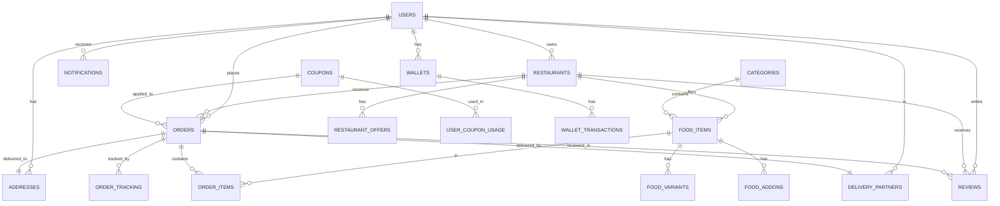

# OneQlick Admin Panel - Database Schema Reference

## 📊 Database Overview

**Database Type**: PostgreSQL  
**Hosting**: Supabase  
**Total Tables**: 40+  
**Schema Version**: 1.0  

---

## 📑 Table of Contents

1. [User Management Tables](#1-user-management-tables)
2. [Restaurant Management Tables](#2-restaurant-management-tables)
3. [Order Management Tables](#3-order-management-tables)
4. [Delivery Management Tables](#4-delivery-management-tables)
5. [Shopping Cart Tables](#5-shopping-cart-tables)
6. [Promotions & Coupons Tables](#6-promotions--coupons-tables)
7. [Reviews & Ratings Tables](#7-reviews--ratings-tables)
8. [Authentication & Security Tables](#8-authentication--security-tables)
9. [Notifications Tables](#9-notifications-tables)
10. [Analytics Tables](#10-analytics-tables)
11. [Enum Types](#11-enum-types)
12. [Indexes & Performance](#12-indexes--performance)
13. [Relationships Diagram](#13-relationships-diagram)

---

## 1. User Management Tables

### 1.1 core_mstr_one_qlick_users_tbl

**Purpose**: Main users table for all user types

| Column | Type | Constraints | Description |
|--------|------|-------------|-------------|
| user_id | UUID | PRIMARY KEY, DEFAULT gen_random_uuid() | Unique user identifier |
| email | VARCHAR(255) | UNIQUE, NOT NULL | User email address |
| phone | VARCHAR(20) | UNIQUE, NOT NULL | User phone number |
| password_hash | VARCHAR(255) | NOT NULL | Hashed password |
| first_name | VARCHAR(100) | NOT NULL | User first name |
| last_name | VARCHAR(100) | NOT NULL | User last name |
| role | user_role | NOT NULL | User role (customer, admin, delivery_partner, restaurant_owner) |
| status | user_status | DEFAULT 'active' | Account status (active, inactive, suspended) |
| profile_image | VARCHAR(500) | | Profile picture URL |
| email_verified | BOOLEAN | DEFAULT FALSE | Email verification status |
| phone_verified | BOOLEAN | DEFAULT FALSE | Phone verification status |
| date_of_birth | DATE | | User date of birth |
| gender | VARCHAR(10) | CHECK (gender IN ('male', 'female', 'other')) | User gender |
| loyalty_points | INTEGER | DEFAULT 0 | Loyalty points balance |
| created_at | TIMESTAMP | DEFAULT CURRENT_TIMESTAMP | Account creation timestamp |
| updated_at | TIMESTAMP | DEFAULT CURRENT_TIMESTAMP | Last update timestamp |

**Indexes**:
- `idx_one_qlick_users_email` ON (email)
- `idx_one_qlick_users_phone` ON (phone)
- `idx_one_qlick_users_role` ON (role)
- `idx_one_qlick_users_status` ON (status)

**Admin Panel Usage**:
- User list view
- User detail view
- User search and filtering
- Role and status management

---

### 1.2 core_mstr_one_qlick_addresses_tbl

**Purpose**: Store user delivery addresses

| Column | Type | Constraints | Description |
|--------|------|-------------|-------------|
| address_id | UUID | PRIMARY KEY, DEFAULT gen_random_uuid() | Unique address identifier |
| user_id | UUID | FOREIGN KEY → users_tbl(user_id), ON DELETE CASCADE | User reference |
| title | VARCHAR(100) | NOT NULL | Address label (Home, Office, etc.) |
| address_line1 | VARCHAR(255) | NOT NULL | Primary address line |
| address_line2 | VARCHAR(255) | | Secondary address line |
| city | VARCHAR(100) | NOT NULL | City name |
| state | VARCHAR(100) | NOT NULL | State name |
| postal_code | VARCHAR(20) | NOT NULL | Postal/ZIP code |
| latitude | DECIMAL(10, 8) | | GPS latitude |
| longitude | DECIMAL(11, 8) | | GPS longitude |
| is_default | BOOLEAN | DEFAULT FALSE | Default address flag |
| address_type | VARCHAR(20) | DEFAULT 'home', CHECK (address_type IN ('home', 'work', 'restaurant', 'other')) | Address type |
| landmark | VARCHAR(255) | | Nearby landmark |
| created_at | TIMESTAMP | DEFAULT CURRENT_TIMESTAMP | Creation timestamp |

**Indexes**:
- `idx_one_qlick_addresses_user_id` ON (user_id)
- `idx_one_qlick_addresses_location` ON (latitude, longitude)

**Admin Panel Usage**:
- View user addresses
- Verify delivery locations
- Address management

---

### 1.3 core_mstr_one_qlick_user_preferences_tbl

**Purpose**: Store user preferences and settings

| Column | Type | Constraints | Description |
|--------|------|-------------|-------------|
| preference_id | UUID | PRIMARY KEY, DEFAULT gen_random_uuid() | Unique preference identifier |
| user_id | UUID | FOREIGN KEY → users_tbl(user_id), ON DELETE CASCADE | User reference |
| notifications_enabled | BOOLEAN | DEFAULT TRUE | Notification preference |
| location_services_enabled | BOOLEAN | DEFAULT TRUE | Location services preference |
| language | VARCHAR(10) | DEFAULT 'en' | Preferred language |
| currency | VARCHAR(3) | DEFAULT 'INR' | Preferred currency |
| dark_mode | BOOLEAN | DEFAULT FALSE | Dark mode preference |
| created_at | TIMESTAMP | DEFAULT CURRENT_TIMESTAMP | Creation timestamp |
| updated_at | TIMESTAMP | DEFAULT CURRENT_TIMESTAMP | Last update timestamp |

**Admin Panel Usage**:
- View user preferences
- Analytics on user preferences

---

### 1.4 core_mstr_one_qlick_user_favorites_tbl

**Purpose**: Track user favorite restaurants

| Column | Type | Constraints | Description |
|--------|------|-------------|-------------|
| favorite_id | UUID | PRIMARY KEY, DEFAULT gen_random_uuid() | Unique favorite identifier |
| user_id | UUID | FOREIGN KEY → users_tbl(user_id), ON DELETE CASCADE | User reference |
| restaurant_id | UUID | FOREIGN KEY → restaurants_tbl(restaurant_id), ON DELETE CASCADE | Restaurant reference |
| created_at | TIMESTAMP | DEFAULT CURRENT_TIMESTAMP | Creation timestamp |

**Constraints**:
- UNIQUE(user_id, restaurant_id)

**Admin Panel Usage**:
- User favorite restaurants
- Restaurant popularity analytics

---

### 1.5 core_mstr_one_qlick_user_payment_methods_tbl

**Purpose**: Store user saved payment methods

| Column | Type | Constraints | Description |
|--------|------|-------------|-------------|
| payment_method_id | UUID | PRIMARY KEY, DEFAULT gen_random_uuid() | Unique payment method identifier |
| user_id | UUID | FOREIGN KEY → users_tbl(user_id), ON DELETE CASCADE | User reference |
| payment_type | payment_method | NOT NULL | Payment type (cash, card, upi, wallet, netbanking, cod) |
| name | VARCHAR(100) | NOT NULL | Payment method name |
| last_four_digits | VARCHAR(4) | | Last 4 digits of card |
| upi_id | VARCHAR(100) | | UPI ID |
| bank_name | VARCHAR(100) | | Bank name |
| is_default | BOOLEAN | DEFAULT FALSE | Default payment method flag |
| is_active | BOOLEAN | DEFAULT TRUE | Active status |
| created_at | TIMESTAMP | DEFAULT CURRENT_TIMESTAMP | Creation timestamp |
| updated_at | TIMESTAMP | DEFAULT CURRENT_TIMESTAMP | Last update timestamp |

**Admin Panel Usage**:
- View user payment methods
- Payment method analytics

---

### 1.6 core_mstr_one_qlick_user_wallets_tbl

**Purpose**: User wallet for cashback and credits

| Column | Type | Constraints | Description |
|--------|------|-------------|-------------|
| wallet_id | UUID | PRIMARY KEY, DEFAULT gen_random_uuid() | Unique wallet identifier |
| user_id | UUID | FOREIGN KEY → users_tbl(user_id), ON DELETE CASCADE | User reference |
| balance | DECIMAL(10, 2) | DEFAULT 0, CHECK (balance >= 0) | Wallet balance |
| currency | VARCHAR(3) | DEFAULT 'INR' | Currency code |
| created_at | TIMESTAMP | DEFAULT CURRENT_TIMESTAMP | Creation timestamp |
| updated_at | TIMESTAMP | DEFAULT CURRENT_TIMESTAMP | Last update timestamp |

**Admin Panel Usage**:
- View user wallet balance
- Add/deduct wallet credits
- Wallet transaction history

---

### 1.7 core_mstr_one_qlick_wallet_transactions_tbl

**Purpose**: Track all wallet transactions

| Column | Type | Constraints | Description |
|--------|------|-------------|-------------|
| transaction_id | UUID | PRIMARY KEY, DEFAULT gen_random_uuid() | Unique transaction identifier |
| wallet_id | UUID | FOREIGN KEY → user_wallets_tbl(wallet_id), ON DELETE CASCADE | Wallet reference |
| order_id | UUID | FOREIGN KEY → orders_tbl(order_id) | Order reference (if applicable) |
| amount | DECIMAL(10, 2) | NOT NULL | Transaction amount |
| transaction_type | VARCHAR(20) | NOT NULL | Type (credit, debit, refund) |
| description | TEXT | | Transaction description |
| created_at | TIMESTAMP | DEFAULT CURRENT_TIMESTAMP | Transaction timestamp |

**Admin Panel Usage**:
- View wallet transaction history
- Refund processing
- Financial reconciliation

---

### 1.8 core_mstr_one_qlick_user_analytics_tbl

**Purpose**: Store aggregated user analytics

| Column | Type | Constraints | Description |
|--------|------|-------------|-------------|
| analytics_id | UUID | PRIMARY KEY, DEFAULT gen_random_uuid() | Unique analytics identifier |
| user_id | UUID | FOREIGN KEY → users_tbl(user_id), ON DELETE CASCADE | User reference |
| total_orders | INTEGER | DEFAULT 0 | Total orders placed |
| total_spent | DECIMAL(10, 2) | DEFAULT 0 | Total amount spent |
| loyalty_points | INTEGER | DEFAULT 0 | Loyalty points earned |
| favorite_cuisine | VARCHAR(100) | | Most ordered cuisine |
| last_order_date | TIMESTAMP | | Last order timestamp |
| created_at | TIMESTAMP | DEFAULT CURRENT_TIMESTAMP | Creation timestamp |
| updated_at | TIMESTAMP | DEFAULT CURRENT_TIMESTAMP | Last update timestamp |

**Admin Panel Usage**:
- User analytics dashboard
- Customer segmentation
- Lifetime value calculation

---

## 2. Restaurant Management Tables

### 2.1 core_mstr_one_qlick_restaurants_tbl

**Purpose**: Main restaurant information

| Column | Type | Constraints | Description |
|--------|------|-------------|-------------|
| restaurant_id | UUID | PRIMARY KEY, DEFAULT gen_random_uuid() | Unique restaurant identifier |
| owner_id | UUID | FOREIGN KEY → users_tbl(user_id) | Restaurant owner reference |
| name | VARCHAR(255) | NOT NULL | Restaurant name |
| description | TEXT | | Restaurant description |
| phone | VARCHAR(20) | NOT NULL | Contact phone |
| email | VARCHAR(255) | | Contact email |
| address_line1 | VARCHAR(255) | NOT NULL | Primary address |
| address_line2 | VARCHAR(255) | | Secondary address |
| city | VARCHAR(100) | NOT NULL | City |
| state | VARCHAR(100) | NOT NULL | State |
| postal_code | VARCHAR(20) | NOT NULL | Postal code |
| latitude | DECIMAL(10, 8) | NOT NULL | GPS latitude |
| longitude | DECIMAL(11, 8) | NOT NULL | GPS longitude |
| image | VARCHAR(500) | | Restaurant logo URL |
| cover_image | VARCHAR(500) | | Cover image URL |
| cuisine_type | VARCHAR(100) | | Cuisine type |
| avg_delivery_time | INTEGER | | Average delivery time (minutes) |
| min_order_amount | DECIMAL(10, 2) | DEFAULT 0 | Minimum order amount |
| delivery_fee | DECIMAL(10, 2) | DEFAULT 0 | Delivery fee |
| rating | DECIMAL(3, 2) | DEFAULT 0 | Average rating |
| total_ratings | INTEGER | DEFAULT 0 | Total number of ratings |
| status | restaurant_status | DEFAULT 'active' | Status (active, inactive, suspended) |
| is_open | BOOLEAN | DEFAULT TRUE | Currently open flag |
| opening_time | TIME | | Opening time |
| closing_time | TIME | | Closing time |
| is_veg | BOOLEAN | DEFAULT FALSE | Serves vegetarian |
| is_pure_veg | BOOLEAN | DEFAULT FALSE | Pure vegetarian only |
| cost_for_two | DECIMAL(10, 2) | | Estimated cost for two |
| platform_fee | DECIMAL(10, 2) | DEFAULT 5 | Platform commission percentage |
| created_at | TIMESTAMP | DEFAULT CURRENT_TIMESTAMP | Creation timestamp |
| updated_at | TIMESTAMP | DEFAULT CURRENT_TIMESTAMP | Last update timestamp |

**Indexes**:
- `idx_one_qlick_restaurants_owner_id` ON (owner_id)
- `idx_one_qlick_restaurants_location` ON (latitude, longitude)
- `idx_one_qlick_restaurants_status` ON (status)
- `idx_one_qlick_restaurants_cuisine` ON (cuisine_type)
- `idx_one_qlick_restaurants_active` ON (restaurant_id) WHERE status = 'active'
- `idx_one_qlick_restaurants_location_status` ON (latitude, longitude, status)

**Admin Panel Usage**:
- Restaurant list and search
- Restaurant approval workflow
- Restaurant detail management
- Performance analytics

---

### 2.2 core_mstr_one_qlick_restaurant_offers_tbl

**Purpose**: Restaurant-specific offers and promotions

| Column | Type | Constraints | Description |
|--------|------|-------------|-------------|
| offer_id | UUID | PRIMARY KEY, DEFAULT gen_random_uuid() | Unique offer identifier |
| restaurant_id | UUID | FOREIGN KEY → restaurants_tbl(restaurant_id), ON DELETE CASCADE | Restaurant reference |
| title | VARCHAR(255) | NOT NULL | Offer title |
| description | TEXT | | Offer description |
| discount_type | VARCHAR(20) | NOT NULL | Type (percentage, fixed, free_delivery) |
| discount_value | DECIMAL(10, 2) | NOT NULL | Discount value |
| min_order_amount | DECIMAL(10, 2) | DEFAULT 0 | Minimum order amount |
| max_discount_amount | DECIMAL(10, 2) | | Maximum discount cap |
| valid_from | TIMESTAMP | NOT NULL | Offer start date |
| valid_until | TIMESTAMP | NOT NULL | Offer end date |
| is_active | BOOLEAN | DEFAULT TRUE | Active status |
| created_at | TIMESTAMP | DEFAULT CURRENT_TIMESTAMP | Creation timestamp |

**Indexes**:
- `idx_one_qlick_restaurant_offers_restaurant` ON (restaurant_id)
- `idx_one_qlick_restaurant_offers_active` ON (is_active)

**Admin Panel Usage**:
- Manage restaurant offers
- Offer performance tracking

---

### 2.3 core_mstr_one_qlick_restaurant_features_tbl

**Purpose**: Restaurant features and badges

| Column | Type | Constraints | Description |
|--------|------|-------------|-------------|
| feature_id | UUID | PRIMARY KEY, DEFAULT gen_random_uuid() | Unique feature identifier |
| restaurant_id | UUID | FOREIGN KEY → restaurants_tbl(restaurant_id), ON DELETE CASCADE | Restaurant reference |
| feature_name | VARCHAR(100) | NOT NULL | Feature name (e.g., "Free Delivery", "Fast Delivery") |
| feature_value | VARCHAR(255) | | Feature value |
| is_active | BOOLEAN | DEFAULT TRUE | Active status |
| created_at | TIMESTAMP | DEFAULT CURRENT_TIMESTAMP | Creation timestamp |

**Admin Panel Usage**:
- Manage restaurant features
- Feature-based filtering

---

### 2.4 core_mstr_one_qlick_categories_tbl

**Purpose**: Global food categories

| Column | Type | Constraints | Description |
|--------|------|-------------|-------------|
| category_id | UUID | PRIMARY KEY, DEFAULT gen_random_uuid() | Unique category identifier |
| name | VARCHAR(100) | NOT NULL | Category name |
| description | TEXT | | Category description |
| image | VARCHAR(500) | | Category image URL |
| is_active | BOOLEAN | DEFAULT TRUE | Active status |
| sort_order | INTEGER | DEFAULT 0 | Display order |
| created_at | TIMESTAMP | DEFAULT CURRENT_TIMESTAMP | Creation timestamp |

**Admin Panel Usage**:
- Category management
- Menu organization

---

### 2.5 core_mstr_one_qlick_food_items_tbl

**Purpose**: Menu items for restaurants

| Column | Type | Constraints | Description |
|--------|------|-------------|-------------|
| food_item_id | UUID | PRIMARY KEY, DEFAULT gen_random_uuid() | Unique food item identifier |
| restaurant_id | UUID | FOREIGN KEY → restaurants_tbl(restaurant_id), ON DELETE CASCADE | Restaurant reference |
| category_id | UUID | FOREIGN KEY → categories_tbl(category_id) | Category reference |
| name | VARCHAR(255) | NOT NULL | Item name |
| description | TEXT | | Item description |
| price | DECIMAL(10, 2) | NOT NULL, CHECK (price >= 0) | Base price |
| discount_price | DECIMAL(10, 2) | | Discounted price |
| image | VARCHAR(500) | | Item image URL |
| is_veg | BOOLEAN | DEFAULT TRUE | Vegetarian flag |
| ingredients | TEXT | | Ingredients list |
| allergens | TEXT | | Allergen information |
| calories | INTEGER | | Calorie count |
| prep_time | INTEGER | | Preparation time (minutes) |
| status | food_status | DEFAULT 'available' | Status (available, unavailable, out_of_stock) |
| rating | DECIMAL(3, 2) | DEFAULT 0 | Average rating |
| total_ratings | INTEGER | DEFAULT 0 | Total ratings |
| sort_order | INTEGER | DEFAULT 0 | Display order |
| is_popular | BOOLEAN | DEFAULT FALSE | Popular item flag |
| is_recommended | BOOLEAN | DEFAULT FALSE | Recommended item flag |
| nutrition_info | JSONB | | Nutrition information (JSON) |
| preparation_time | VARCHAR(20) | | Preparation time display |
| created_at | TIMESTAMP | DEFAULT CURRENT_TIMESTAMP | Creation timestamp |
| updated_at | TIMESTAMP | DEFAULT CURRENT_TIMESTAMP | Last update timestamp |

**Indexes**:
- `idx_one_qlick_food_items_restaurant` ON (restaurant_id)
- `idx_one_qlick_food_items_category` ON (category_id)
- `idx_one_qlick_food_items_status` ON (status)
- `idx_one_qlick_food_items_available` ON (food_item_id) WHERE status = 'available'
- `idx_one_qlick_food_items_restaurant_status` ON (restaurant_id, status)

**Admin Panel Usage**:
- Menu item management
- Popular items tracking
- Inventory management

---

### 2.6 core_mstr_one_qlick_food_variants_tbl

**Purpose**: Food item size variants

| Column | Type | Constraints | Description |
|--------|------|-------------|-------------|
| food_variant_id | UUID | PRIMARY KEY, DEFAULT gen_random_uuid() | Unique variant identifier |
| food_item_id | UUID | FOREIGN KEY → food_items_tbl(food_item_id), ON DELETE CASCADE | Food item reference |
| name | VARCHAR(100) | NOT NULL | Variant name (Small, Medium, Large) |
| price_adjustment | DECIMAL(10, 2) | DEFAULT 0 | Price adjustment |
| is_default | BOOLEAN | DEFAULT FALSE | Default variant flag |
| created_at | TIMESTAMP | DEFAULT CURRENT_TIMESTAMP | Creation timestamp |

**Admin Panel Usage**:
- Variant management
- Pricing configuration

---

### 2.7 core_mstr_one_qlick_food_addons_tbl

**Purpose**: Available add-ons for food items

| Column | Type | Constraints | Description |
|--------|------|-------------|-------------|
| addon_id | UUID | PRIMARY KEY, DEFAULT gen_random_uuid() | Unique addon identifier |
| food_item_id | UUID | FOREIGN KEY → food_items_tbl(food_item_id), ON DELETE CASCADE | Food item reference |
| name | VARCHAR(100) | NOT NULL | Addon name |
| price | DECIMAL(10, 2) | NOT NULL, CHECK (price >= 0) | Addon price |
| is_available | BOOLEAN | DEFAULT TRUE | Availability status |
| sort_order | INTEGER | DEFAULT 0 | Display order |
| created_at | TIMESTAMP | DEFAULT CURRENT_TIMESTAMP | Creation timestamp |

**Admin Panel Usage**:
- Addon management
- Pricing configuration

---

### 2.8 core_mstr_one_qlick_food_customizations_tbl

**Purpose**: Customization options for food items

| Column | Type | Constraints | Description |
|--------|------|-------------|-------------|
| customization_id | UUID | PRIMARY KEY, DEFAULT gen_random_uuid() | Unique customization identifier |
| food_item_id | UUID | FOREIGN KEY → food_items_tbl(food_item_id), ON DELETE CASCADE | Food item reference |
| name | VARCHAR(100) | NOT NULL | Customization name (e.g., "Spice Level") |
| is_required | BOOLEAN | DEFAULT FALSE | Required flag |
| max_selections | INTEGER | DEFAULT 1 | Maximum selections allowed |
| sort_order | INTEGER | DEFAULT 0 | Display order |
| created_at | TIMESTAMP | DEFAULT CURRENT_TIMESTAMP | Creation timestamp |

**Admin Panel Usage**:
- Customization management

---

### 2.9 core_mstr_one_qlick_customization_options_tbl

**Purpose**: Options for customizations

| Column | Type | Constraints | Description |
|--------|------|-------------|-------------|
| option_id | UUID | PRIMARY KEY, DEFAULT gen_random_uuid() | Unique option identifier |
| customization_id | UUID | FOREIGN KEY → food_customizations_tbl(customization_id), ON DELETE CASCADE | Customization reference |
| name | VARCHAR(100) | NOT NULL | Option name (e.g., "Mild", "Medium", "Spicy") |
| price_adjustment | DECIMAL(10, 2) | DEFAULT 0 | Price adjustment |
| is_available | BOOLEAN | DEFAULT TRUE | Availability status |
| sort_order | INTEGER | DEFAULT 0 | Display order |
| created_at | TIMESTAMP | DEFAULT CURRENT_TIMESTAMP | Creation timestamp |

**Admin Panel Usage**:
- Option management

---

## 3. Order Management Tables

### 3.1 core_mstr_one_qlick_orders_tbl

**Purpose**: Main orders table

| Column | Type | Constraints | Description |
|--------|------|-------------|-------------|
| order_id | UUID | PRIMARY KEY, DEFAULT gen_random_uuid() | Unique order identifier |
| customer_id | UUID | FOREIGN KEY → users_tbl(user_id) | Customer reference |
| restaurant_id | UUID | FOREIGN KEY → restaurants_tbl(restaurant_id) | Restaurant reference |
| delivery_partner_id | UUID | FOREIGN KEY → users_tbl(user_id) | Delivery partner reference |
| delivery_address_id | UUID | FOREIGN KEY → addresses_tbl(address_id) | Delivery address reference |
| order_number | VARCHAR(50) | UNIQUE, NOT NULL | Human-readable order number |
| subtotal | DECIMAL(10, 2) | NOT NULL | Order subtotal |
| tax_amount | DECIMAL(10, 2) | DEFAULT 0 | Tax amount |
| delivery_fee | DECIMAL(10, 2) | DEFAULT 0 | Delivery fee |
| discount_amount | DECIMAL(10, 2) | DEFAULT 0 | Discount applied |
| total_amount | DECIMAL(10, 2) | NOT NULL, CHECK (total_amount >= 0) | Final total amount |
| payment_method | payment_method | | Payment method used |
| payment_status | payment_status | DEFAULT 'pending' | Payment status (pending, paid, failed, refunded) |
| payment_id | VARCHAR(255) | | Payment gateway transaction ID |
| order_status | order_status | DEFAULT 'pending' | Order status |
| estimated_delivery_time | TIMESTAMP | | Estimated delivery time |
| actual_delivery_time | TIMESTAMP | | Actual delivery time |
| special_instructions | TEXT | | Customer instructions |
| cancellation_reason | TEXT | | Cancellation reason |
| rating | INTEGER | CHECK (rating >= 1 AND rating <= 5) | Customer rating |
| review | TEXT | | Customer review |
| created_at | TIMESTAMP | DEFAULT CURRENT_TIMESTAMP | Order creation timestamp |
| updated_at | TIMESTAMP | DEFAULT CURRENT_TIMESTAMP | Last update timestamp |

**Indexes**:
- `idx_one_qlick_orders_customer` ON (customer_id)
- `idx_one_qlick_orders_restaurant` ON (restaurant_id)
- `idx_one_qlick_orders_delivery_partner` ON (delivery_partner_id)
- `idx_one_qlick_orders_status` ON (order_status)
- `idx_one_qlick_orders_payment_status` ON (payment_status)
- `idx_one_qlick_orders_created_at` ON (created_at)
- `idx_one_qlick_orders_order_number` ON (order_number)
- `idx_one_qlick_orders_customer_status` ON (customer_id, order_status)
- `idx_one_qlick_orders_restaurant_status` ON (restaurant_id, order_status)
- `idx_one_qlick_orders_active` ON (order_id) WHERE order_status IN ('pending', 'confirmed', 'preparing', 'ready_for_pickup', 'out_for_delivery')

**Admin Panel Usage**:
- Order list and search
- Order detail view
- Order status management
- Order analytics

---

### 3.2 core_mstr_one_qlick_order_items_tbl

**Purpose**: Items in each order

| Column | Type | Constraints | Description |
|--------|------|-------------|-------------|
| order_item_id | UUID | PRIMARY KEY, DEFAULT gen_random_uuid() | Unique order item identifier |
| order_id | UUID | FOREIGN KEY → orders_tbl(order_id), ON DELETE CASCADE | Order reference |
| food_item_id | UUID | FOREIGN KEY → food_items_tbl(food_item_id) | Food item reference |
| variant_id | UUID | FOREIGN KEY → food_variants_tbl(food_variant_id) | Variant reference |
| quantity | INTEGER | NOT NULL | Quantity ordered |
| unit_price | DECIMAL(10, 2) | NOT NULL | Unit price at time of order |
| total_price | DECIMAL(10, 2) | NOT NULL | Total price for this item |
| special_instructions | TEXT | | Item-specific instructions |
| created_at | TIMESTAMP | DEFAULT CURRENT_TIMESTAMP | Creation timestamp |

**Indexes**:
- `idx_one_qlick_order_items_order_id` ON (order_id)
- `idx_one_qlick_order_items_food_item_id` ON (food_item_id)

**Admin Panel Usage**:
- Order details
- Popular items analytics

---

### 3.3 core_mstr_one_qlick_order_tracking_tbl

**Purpose**: Order status tracking

| Column | Type | Constraints | Description |
|--------|------|-------------|-------------|
| order_tracking_id | UUID | PRIMARY KEY, DEFAULT gen_random_uuid() | Unique tracking identifier |
| order_id | UUID | FOREIGN KEY → orders_tbl(order_id), ON DELETE CASCADE | Order reference |
| status | order_status | NOT NULL | Order status |
| latitude | DECIMAL(10, 8) | | GPS latitude |
| longitude | DECIMAL(11, 8) | | GPS longitude |
| notes | TEXT | | Status notes |
| created_at | TIMESTAMP | DEFAULT CURRENT_TIMESTAMP | Status change timestamp |

**Indexes**:
- `idx_one_qlick_order_tracking_order` ON (order_id)
- `idx_one_qlick_order_tracking_status` ON (status)

**Admin Panel Usage**:
- Order timeline
- Delivery tracking

---

### 3.4 core_mstr_one_qlick_order_status_history_tbl

**Purpose**: Detailed order status history

| Column | Type | Constraints | Description |
|--------|------|-------------|-------------|
| status_history_id | UUID | PRIMARY KEY, DEFAULT gen_random_uuid() | Unique history identifier |
| order_id | UUID | FOREIGN KEY → orders_tbl(order_id), ON DELETE CASCADE | Order reference |
| status | order_status | NOT NULL | Order status |
| status_message | TEXT | | Status message |
| latitude | DECIMAL(10, 8) | | GPS latitude |
| longitude | DECIMAL(11, 8) | | GPS longitude |
| updated_by | UUID | FOREIGN KEY → users_tbl(user_id) | User who updated status |
| created_at | TIMESTAMP | DEFAULT CURRENT_TIMESTAMP | Status change timestamp |

**Indexes**:
- `idx_one_qlick_order_status_history_order` ON (order_id)

**Admin Panel Usage**:
- Detailed order timeline
- Audit trail

---

### 3.5 core_mstr_one_qlick_order_item_customizations_tbl

**Purpose**: Store selected customizations for order items

| Column | Type | Constraints | Description |
|--------|------|-------------|-------------|
| order_item_customization_id | UUID | PRIMARY KEY, DEFAULT gen_random_uuid() | Unique customization identifier |
| order_item_id | UUID | FOREIGN KEY → order_items_tbl(order_item_id), ON DELETE CASCADE | Order item reference |
| customization_id | UUID | FOREIGN KEY → food_customizations_tbl(customization_id) | Customization reference |
| option_id | UUID | FOREIGN KEY → customization_options_tbl(option_id) | Option reference |
| created_at | TIMESTAMP | DEFAULT CURRENT_TIMESTAMP | Creation timestamp |

**Indexes**:
- `idx_one_qlick_order_item_customizations_order_item` ON (order_item_id)

**Admin Panel Usage**:
- Order details
- Customization analytics

---

### 3.6 core_mstr_one_qlick_order_item_addons_tbl

**Purpose**: Store selected add-ons for order items

| Column | Type | Constraints | Description |
|--------|------|-------------|-------------|
| order_item_addon_id | UUID | PRIMARY KEY, DEFAULT gen_random_uuid() | Unique addon identifier |
| order_item_id | UUID | FOREIGN KEY → order_items_tbl(order_item_id), ON DELETE CASCADE | Order item reference |
| addon_id | UUID | FOREIGN KEY → food_addons_tbl(addon_id) | Addon reference |
| quantity | INTEGER | DEFAULT 1 | Addon quantity |
| created_at | TIMESTAMP | DEFAULT CURRENT_TIMESTAMP | Creation timestamp |

**Indexes**:
- `idx_one_qlick_order_item_addons_order_item` ON (order_item_id)

**Admin Panel Usage**:
- Order details
- Addon popularity analytics

---

## 4. Delivery Management Tables

### 4.1 core_mstr_one_qlick_delivery_partners_tbl

**Purpose**: Delivery partner information

| Column | Type | Constraints | Description |
|--------|------|-------------|-------------|
| delivery_partner_id | UUID | PRIMARY KEY, DEFAULT gen_random_uuid() | Unique delivery partner identifier |
| user_id | UUID | FOREIGN KEY → users_tbl(user_id), ON DELETE CASCADE | User reference |
| vehicle_type | vehicle_type | NOT NULL | Vehicle type (bicycle, motorcycle, car) |
| vehicle_number | VARCHAR(50) | NOT NULL | Vehicle registration number |
| license_number | VARCHAR(50) | NOT NULL | Driver's license number |
| current_latitude | DECIMAL(10, 8) | | Current GPS latitude |
| current_longitude | DECIMAL(11, 8) | | Current GPS longitude |
| availability_status | availability_status | DEFAULT 'offline' | Status (available, busy, offline) |
| rating | DECIMAL(3, 2) | DEFAULT 0 | Average rating |
| total_ratings | INTEGER | DEFAULT 0 | Total ratings |
| total_deliveries | INTEGER | DEFAULT 0 | Total deliveries completed |
| documents_json | JSONB | | Document URLs (JSON) |
| is_verified | BOOLEAN | DEFAULT FALSE | Verification status |
| created_at | TIMESTAMP | DEFAULT CURRENT_TIMESTAMP | Creation timestamp |
| updated_at | TIMESTAMP | DEFAULT CURRENT_TIMESTAMP | Last update timestamp |

**Indexes**:
- `idx_one_qlick_delivery_partners_user_id` ON (user_id)
- `idx_one_qlick_delivery_partners_availability` ON (availability_status)
- `idx_one_qlick_delivery_partners_location` ON (current_latitude, current_longitude)

**Admin Panel Usage**:
- Delivery partner list
- Partner verification
- Performance tracking
- Real-time location monitoring

---

### 4.2 core_mstr_one_qlick_driver_locations_tbl

**Purpose**: Track delivery partner location history

| Column | Type | Constraints | Description |
|--------|------|-------------|-------------|
| location_id | UUID | PRIMARY KEY, DEFAULT gen_random_uuid() | Unique location identifier |
| delivery_partner_id | UUID | FOREIGN KEY → delivery_partners_tbl(delivery_partner_id), ON DELETE CASCADE | Delivery partner reference |
| order_id | UUID | FOREIGN KEY → orders_tbl(order_id) | Order reference |
| latitude | DECIMAL(10, 8) | NOT NULL | GPS latitude |
| longitude | DECIMAL(11, 8) | NOT NULL | GPS longitude |
| created_at | TIMESTAMP | DEFAULT CURRENT_TIMESTAMP | Location timestamp |

**Indexes**:
- `idx_one_qlick_driver_locations_partner` ON (delivery_partner_id)
- `idx_one_qlick_driver_locations_order` ON (order_id)

**Admin Panel Usage**:
- Delivery tracking
- Route optimization analytics

---

## 5. Shopping Cart Tables

### 5.1 core_mstr_one_qlick_cart_tbl

**Purpose**: User shopping carts

| Column | Type | Constraints | Description |
|--------|------|-------------|-------------|
| cart_id | UUID | PRIMARY KEY, DEFAULT gen_random_uuid() | Unique cart identifier |
| user_id | UUID | FOREIGN KEY → users_tbl(user_id), ON DELETE CASCADE | User reference |
| restaurant_id | UUID | FOREIGN KEY → restaurants_tbl(restaurant_id) | Restaurant reference |
| created_at | TIMESTAMP | DEFAULT CURRENT_TIMESTAMP | Creation timestamp |
| updated_at | TIMESTAMP | DEFAULT CURRENT_TIMESTAMP | Last update timestamp |

**Indexes**:
- `idx_one_qlick_cart_user` ON (user_id)

**Admin Panel Usage**:
- Abandoned cart analytics
- Cart value analytics

---

### 5.2 core_mstr_one_qlick_cart_items_tbl

**Purpose**: Items in shopping carts

| Column | Type | Constraints | Description |
|--------|------|-------------|-------------|
| cart_item_id | UUID | PRIMARY KEY, DEFAULT gen_random_uuid() | Unique cart item identifier |
| cart_id | UUID | FOREIGN KEY → cart_tbl(cart_id), ON DELETE CASCADE | Cart reference |
| food_item_id | UUID | FOREIGN KEY → food_items_tbl(food_item_id) | Food item reference |
| quantity | INTEGER | NOT NULL, CHECK (quantity > 0) | Quantity |
| special_instructions | TEXT | | Item instructions |
| created_at | TIMESTAMP | DEFAULT CURRENT_TIMESTAMP | Creation timestamp |
| updated_at | TIMESTAMP | DEFAULT CURRENT_TIMESTAMP | Last update timestamp |

**Indexes**:
- `idx_one_qlick_cart_items_cart` ON (cart_id)

**Admin Panel Usage**:
- Cart analytics

---

### 5.3 core_mstr_one_qlick_cart_item_customizations_tbl

**Purpose**: Customizations for cart items

| Column | Type | Constraints | Description |
|--------|------|-------------|-------------|
| cart_item_customization_id | UUID | PRIMARY KEY, DEFAULT gen_random_uuid() | Unique customization identifier |
| cart_item_id | UUID | FOREIGN KEY → cart_items_tbl(cart_item_id), ON DELETE CASCADE | Cart item reference |
| customization_id | UUID | FOREIGN KEY → food_customizations_tbl(customization_id) | Customization reference |
| option_id | UUID | FOREIGN KEY → customization_options_tbl(option_id) | Option reference |
| created_at | TIMESTAMP | DEFAULT CURRENT_TIMESTAMP | Creation timestamp |

**Indexes**:
- `idx_one_qlick_cart_item_customizations_cart_item` ON (cart_item_id)

---

### 5.4 core_mstr_one_qlick_cart_item_addons_tbl

**Purpose**: Add-ons for cart items

| Column | Type | Constraints | Description |
|--------|------|-------------|-------------|
| cart_item_addon_id | UUID | PRIMARY KEY, DEFAULT gen_random_uuid() | Unique addon identifier |
| cart_item_id | UUID | FOREIGN KEY → cart_items_tbl(cart_item_id), ON DELETE CASCADE | Cart item reference |
| addon_id | UUID | FOREIGN KEY → food_addons_tbl(addon_id) | Addon reference |
| quantity | INTEGER | DEFAULT 1 | Addon quantity |
| created_at | TIMESTAMP | DEFAULT CURRENT_TIMESTAMP | Creation timestamp |

**Indexes**:
- `idx_one_qlick_cart_item_addons_cart_item` ON (cart_item_id)

---

## 6. Promotions & Coupons Tables

### 6.1 core_mstr_one_qlick_coupons_tbl

**Purpose**: Platform-wide coupons

| Column | Type | Constraints | Description |
|--------|------|-------------|-------------|
| coupon_id | UUID | PRIMARY KEY, DEFAULT gen_random_uuid() | Unique coupon identifier |
| code | VARCHAR(50) | UNIQUE, NOT NULL | Coupon code |
| title | VARCHAR(255) | NOT NULL | Coupon title |
| description | TEXT | | Coupon description |
| coupon_type | coupon_type | NOT NULL | Type (percentage, fixed_amount, free_delivery) |
| discount_value | DECIMAL(10, 2) | NOT NULL | Discount value |
| min_order_amount | DECIMAL(10, 2) | DEFAULT 0 | Minimum order amount |
| max_discount_amount | DECIMAL(10, 2) | | Maximum discount cap |
| usage_limit | INTEGER | | Total usage limit |
| used_count | INTEGER | DEFAULT 0 | Current usage count |
| valid_from | TIMESTAMP | NOT NULL | Valid from date |
| valid_until | TIMESTAMP | NOT NULL | Valid until date |
| is_active | BOOLEAN | DEFAULT TRUE | Active status |
| created_at | TIMESTAMP | DEFAULT CURRENT_TIMESTAMP | Creation timestamp |

**Indexes**:
- `idx_one_qlick_coupons_code` ON (code)
- `idx_one_qlick_coupons_active` ON (is_active)
- `idx_one_qlick_coupons_validity` ON (valid_from, valid_until)

**Admin Panel Usage**:
- Coupon management
- Coupon performance analytics

---

### 6.2 core_mstr_one_qlick_user_coupon_usage_tbl

**Purpose**: Track coupon usage by users

| Column | Type | Constraints | Description |
|--------|------|-------------|-------------|
| user_coupon_usage_id | UUID | PRIMARY KEY, DEFAULT gen_random_uuid() | Unique usage identifier |
| user_id | UUID | FOREIGN KEY → users_tbl(user_id) | User reference |
| coupon_id | UUID | FOREIGN KEY → coupons_tbl(coupon_id) | Coupon reference |
| order_id | UUID | FOREIGN KEY → orders_tbl(order_id) | Order reference |
| used_at | TIMESTAMP | DEFAULT CURRENT_TIMESTAMP | Usage timestamp |

**Constraints**:
- UNIQUE(user_id, coupon_id, order_id)

**Indexes**:
- `idx_one_qlick_user_coupon_usage_user_id` ON (user_id)
- `idx_one_qlick_user_coupon_usage_coupon_id` ON (coupon_id)

**Admin Panel Usage**:
- Coupon usage tracking
- User segmentation

---

## 7. Reviews & Ratings Tables

### 7.1 core_mstr_one_qlick_reviews_tbl

**Purpose**: Customer reviews for restaurants and delivery partners

| Column | Type | Constraints | Description |
|--------|------|-------------|-------------|
| review_id | UUID | PRIMARY KEY, DEFAULT gen_random_uuid() | Unique review identifier |
| order_id | UUID | FOREIGN KEY → orders_tbl(order_id) | Order reference |
| customer_id | UUID | FOREIGN KEY → users_tbl(user_id) | Customer reference |
| restaurant_id | UUID | FOREIGN KEY → restaurants_tbl(restaurant_id) | Restaurant reference |
| delivery_partner_id | UUID | FOREIGN KEY → users_tbl(user_id) | Delivery partner reference |
| rating | INTEGER | NOT NULL, CHECK (rating >= 1 AND rating <= 5) | Rating (1-5) |
| review_text | TEXT | | Review text |
| review_type | VARCHAR(20) | NOT NULL | Type (restaurant, delivery) |
| created_at | TIMESTAMP | DEFAULT CURRENT_TIMESTAMP | Creation timestamp |

**Indexes**:
- `idx_one_qlick_reviews_order_id` ON (order_id)
- `idx_one_qlick_reviews_customer_id` ON (customer_id)
- `idx_one_qlick_reviews_restaurant_id` ON (restaurant_id)
- `idx_one_qlick_reviews_delivery_partner_id` ON (delivery_partner_id)

**Admin Panel Usage**:
- Review moderation
- Rating analytics
- Quality monitoring

---

## 8. Authentication & Security Tables

### 8.1 core_mstr_one_qlick_refresh_tokens_tbl

**Purpose**: JWT refresh tokens

| Column | Type | Constraints | Description |
|--------|------|-------------|-------------|
| token_id | UUID | PRIMARY KEY, DEFAULT gen_random_uuid() | Unique token identifier |
| user_id | UUID | FOREIGN KEY → users_tbl(user_id), ON DELETE CASCADE | User reference |
| token_hash | VARCHAR(255) | NOT NULL | Hashed refresh token |
| device_info | JSONB | | Device information (JSON) |
| ip_address | VARCHAR(45) | | IP address |
| user_agent | TEXT | | User agent string |
| expires_at | TIMESTAMP | NOT NULL | Expiration timestamp |
| is_revoked | BOOLEAN | DEFAULT FALSE | Revoked status |
| created_at | TIMESTAMP | DEFAULT CURRENT_TIMESTAMP | Creation timestamp |

**Admin Panel Usage**:
- Session management
- Security monitoring

---

### 8.2 core_mstr_one_qlick_oauth_providers_tbl

**Purpose**: OAuth provider connections

| Column | Type | Constraints | Description |
|--------|------|-------------|-------------|
| oauth_provider_id | UUID | PRIMARY KEY, DEFAULT gen_random_uuid() | Unique provider identifier |
| user_id | UUID | FOREIGN KEY → users_tbl(user_id), ON DELETE CASCADE | User reference |
| provider | VARCHAR(50) | NOT NULL | Provider name (google, facebook, etc.) |
| provider_user_id | VARCHAR(255) | NOT NULL | Provider's user ID |
| provider_email | VARCHAR(255) | | Provider email |
| provider_name | VARCHAR(255) | | Provider display name |
| provider_photo_url | VARCHAR(500) | | Provider photo URL |
| created_at | TIMESTAMP | DEFAULT CURRENT_TIMESTAMP | Creation timestamp |

**Admin Panel Usage**:
- OAuth connection tracking

---

### 8.3 core_mstr_one_qlick_otp_verification_tbl

**Purpose**: OTP verification records

| Column | Type | Constraints | Description |
|--------|------|-------------|-------------|
| otp_id | UUID | PRIMARY KEY, DEFAULT gen_random_uuid() | Unique OTP identifier |
| user_id | UUID | | User reference (nullable for pending users) |
| email | VARCHAR(255) | | Email address |
| phone | VARCHAR(20) | | Phone number |
| otp_code | VARCHAR(6) | NOT NULL | OTP code |
| otp_type | VARCHAR(50) | NOT NULL | Type (email_verification, password_reset, etc.) |
| is_verified | BOOLEAN | DEFAULT FALSE | Verification status |
| attempts | INTEGER | DEFAULT 0 | Verification attempts |
| max_attempts | INTEGER | DEFAULT 3 | Maximum attempts allowed |
| expires_at | TIMESTAMP | NOT NULL | Expiration timestamp |
| created_at | TIMESTAMP | DEFAULT CURRENT_TIMESTAMP | Creation timestamp |

**Admin Panel Usage**:
- OTP verification monitoring
- Security analytics

---

### 8.4 core_mstr_one_qlick_user_sessions_tbl

**Purpose**: Active user sessions

| Column | Type | Constraints | Description |
|--------|------|-------------|-------------|
| session_id | UUID | PRIMARY KEY, DEFAULT gen_random_uuid() | Unique session identifier |
| user_id | UUID | FOREIGN KEY → users_tbl(user_id), ON DELETE CASCADE | User reference |
| device_id | VARCHAR(255) | | Device identifier |
| device_name | VARCHAR(255) | | Device name |
| device_type | VARCHAR(50) | | Device type (mobile, tablet, desktop) |
| platform | VARCHAR(50) | | Platform (iOS, Android, Web) |
| app_version | VARCHAR(20) | | App version |
| ip_address | VARCHAR(45) | | IP address |
| user_agent | TEXT | | User agent string |
| is_active | BOOLEAN | DEFAULT TRUE | Active status |
| last_activity | TIMESTAMP | DEFAULT CURRENT_TIMESTAMP | Last activity timestamp |
| created_at | TIMESTAMP | DEFAULT CURRENT_TIMESTAMP | Creation timestamp |
| updated_at | TIMESTAMP | DEFAULT CURRENT_TIMESTAMP | Last update timestamp |

**Admin Panel Usage**:
- Session management
- Device tracking
- Security monitoring

---

### 8.5 core_mstr_one_qlick_password_reset_tokens_tbl

**Purpose**: Password reset tokens

| Column | Type | Constraints | Description |
|--------|------|-------------|-------------|
| token_id | UUID | PRIMARY KEY, DEFAULT gen_random_uuid() | Unique token identifier |
| user_id | UUID | FOREIGN KEY → users_tbl(user_id), ON DELETE CASCADE | User reference |
| token_hash | VARCHAR(255) | NOT NULL | Hashed reset token |
| expires_at | TIMESTAMP | NOT NULL | Expiration timestamp |
| is_used | BOOLEAN | DEFAULT FALSE | Used status |
| created_at | TIMESTAMP | DEFAULT CURRENT_TIMESTAMP | Creation timestamp |

**Admin Panel Usage**:
- Password reset monitoring

---

## 9. Notifications Tables

### 9.1 core_mstr_one_qlick_notifications_tbl

**Purpose**: System notifications

| Column | Type | Constraints | Description |
|--------|------|-------------|-------------|
| notification_id | UUID | PRIMARY KEY, DEFAULT gen_random_uuid() | Unique notification identifier |
| user_id | UUID | FOREIGN KEY → users_tbl(user_id) | User reference |
| title | VARCHAR(255) | NOT NULL | Notification title |
| message | TEXT | NOT NULL | Notification message |
| notification_type | notification_type | DEFAULT 'system' | Type (order_update, promotion, system) |
| is_read | BOOLEAN | DEFAULT FALSE | Read status |
| data_json | JSONB | | Additional data (JSON) |
| created_at | TIMESTAMP | DEFAULT CURRENT_TIMESTAMP | Creation timestamp |

**Indexes**:
- `idx_one_qlick_notifications_user_id` ON (user_id)
- `idx_one_qlick_notifications_read_status` ON (is_read)
- `idx_one_qlick_notifications_type` ON (notification_type)

**Admin Panel Usage**:
- Send notifications
- Notification analytics

---

## 10. Analytics Tables

### 10.1 core_mstr_one_qlick_search_history_tbl

**Purpose**: Track user search queries

| Column | Type | Constraints | Description |
|--------|------|-------------|-------------|
| search_id | UUID | PRIMARY KEY, DEFAULT gen_random_uuid() | Unique search identifier |
| user_id | UUID | FOREIGN KEY → users_tbl(user_id), ON DELETE CASCADE | User reference |
| search_query | VARCHAR(255) | NOT NULL | Search query |
| search_type | VARCHAR(20) | NOT NULL | Type (restaurant, food, general) |
| results_count | INTEGER | DEFAULT 0 | Number of results |
| created_at | TIMESTAMP | DEFAULT CURRENT_TIMESTAMP | Search timestamp |

**Indexes**:
- `idx_one_qlick_search_history_user` ON (user_id)

**Admin Panel Usage**:
- Search analytics
- Popular searches
- Search optimization

---

## 11. Enum Types

### 11.1 user_role
```sql
CREATE TYPE user_role AS ENUM (
    'customer',
    'admin',
    'delivery_partner',
    'restaurant_owner'
);
```

### 11.2 user_status
```sql
CREATE TYPE user_status AS ENUM (
    'active',
    'inactive',
    'suspended'
);
```

### 11.3 restaurant_status
```sql
CREATE TYPE restaurant_status AS ENUM (
    'active',
    'inactive',
    'suspended'
);
```

### 11.4 food_status
```sql
CREATE TYPE food_status AS ENUM (
    'available',
    'unavailable',
    'out_of_stock'
);
```

### 11.5 order_status
```sql
CREATE TYPE order_status AS ENUM (
    'pending',
    'confirmed',
    'preparing',
    'ready_for_pickup',
    'picked_up',
    'out_for_delivery',
    'delivered',
    'cancelled',
    'refunded'
);
```

### 11.6 payment_status
```sql
CREATE TYPE payment_status AS ENUM (
    'pending',
    'paid',
    'failed',
    'refunded'
);
```

### 11.7 payment_method
```sql
CREATE TYPE payment_method AS ENUM (
    'cash',
    'card',
    'upi',
    'wallet',
    'netbanking',
    'cod'
);
```

### 11.8 vehicle_type
```sql
CREATE TYPE vehicle_type AS ENUM (
    'bicycle',
    'motorcycle',
    'car'
);
```

### 11.9 availability_status
```sql
CREATE TYPE availability_status AS ENUM (
    'available',
    'busy',
    'offline'
);
```

### 11.10 coupon_type
```sql
CREATE TYPE coupon_type AS ENUM (
    'percentage',
    'fixed_amount',
    'free_delivery'
);
```

### 11.11 notification_type
```sql
CREATE TYPE notification_type AS ENUM (
    'order_update',
    'promotion',
    'system'
);
```

---

## 12. Indexes & Performance

### Composite Indexes
```sql
-- Order queries
CREATE INDEX idx_one_qlick_orders_customer_status 
    ON core_mstr_one_qlick_orders_tbl(customer_id, order_status);

CREATE INDEX idx_one_qlick_orders_restaurant_status 
    ON core_mstr_one_qlick_orders_tbl(restaurant_id, order_status);

-- Food item queries
CREATE INDEX idx_one_qlick_food_items_restaurant_status 
    ON core_mstr_one_qlick_food_items_tbl(restaurant_id, status);

-- Restaurant location queries
CREATE INDEX idx_one_qlick_restaurants_location_status 
    ON core_mstr_one_qlick_restaurants_tbl(latitude, longitude, status);
```

### Partial Indexes
```sql
-- Active restaurants only
CREATE INDEX idx_one_qlick_restaurants_active 
    ON core_mstr_one_qlick_restaurants_tbl(restaurant_id) 
    WHERE status = 'active';

-- Available food items only
CREATE INDEX idx_one_qlick_food_items_available 
    ON core_mstr_one_qlick_food_items_tbl(food_item_id) 
    WHERE status = 'available';

-- Active orders only
CREATE INDEX idx_one_qlick_orders_active 
    ON core_mstr_one_qlick_orders_tbl(order_id) 
    WHERE order_status IN ('pending', 'confirmed', 'preparing', 'ready_for_pickup', 'out_for_delivery');
```

---

## 13. Relationships Diagram



---

**Document Version**: 1.0  
**Last Updated**: 2026-01-02  
**Status**: Reference Document
